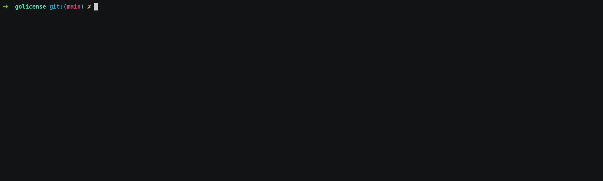

# lian

lian is a license analyzer for Go binaries and modules.

It aims to help in the following use cases:

- report all the dependencies, their versions, and licenses type along with the URL on pkg.go.dev
- dump and combine all licenses to comply with package distribution
- check against a set of allowed licenses

## Example

`lian` in action with itself

<div align="center">
    
</div>

## How it works

It is designed to work without connecting to third-party services.

The licenses are detected using the
[google/licensecheck](https://github.com/google/licensecheck) library that will scans
source texts for known licenses directly from the [module cache](https://go.dev/ref/mod#module-cache).

The module cache usually is already warmed if the module has been already built locally.
If the dependencies are not present the `-d, --download` option can be specified and it will automatically download the dependencies using the `go mod download` command.

## Installation

```sh
go install lucor.dev/lian@latest
```

Note: requires Go >= 1.18

## Download

Pre-built binaries can be downloaded from the [releases](https://lucor.dev/lian/releases) page

## Usage

```sh
Usage: lian [OPTIONS] [PATH]

Options:
  -a, --allowed          comma separated list of allowed licenses (i.e. MIT, BSD-3-Clause). Default to all
  -e, --excluded         comma separated list of repository with version excluded from the licenses check. Default to none
  -d, --download         download dependencies to local cache
      --dump             dump all licenses
  -h, --help             show this help message
      --list-names       list the names of the license file can be detected and exit
      --list-licenses    list the licenses can be detected and exit
  -o, --output <file>    write to file instead of stdout
     --version          show the version number
```

### License check for a Go module

```sh
lian --allowed "MIT,BSD-3-CLAUSE" /path/to/go.mod
```

### Dump all licenses to a file for a Go binary

```sh
lian --dump -o LICENSE-THIRD-PARTY /path/to/go_binary
```

### License check as GitHub action

```yml
name: License check
on: [push, pull_request]

jobs:
  checks:
    runs-on: ubuntu-latest
    steps:
    - uses: actions/checkout@v4
    - uses: actions/setup-go@v5
      with:
        go-version: 'stable'

    - name: install lian
      run: go install lucor.dev/lian@latest

    - name: license check against go.mod
      run: lian -d --allowed="BSD-2-Clause, BSD-3-Clause, MIT"

    - name: build
      run: go build

    - name: License check against the Go binary
      run: lian --allowed="BSD-2-Clause, BSD-3-Clause, MIT" ./lian
```

See in [action](https://github.com/lucor/lian/actions/workflows/license_check.yml) against this repo.
